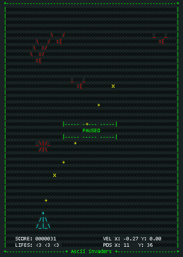

ASCIIinvader
============

Javascript - invader game using @Bradshaw 
[/ASCII-Warriors](https://github.com/Bradshaw/ASCII-Warriors) framework.

Enter=pause/continue, Arrows=move, z=shot

Check out this _ugly_ beauty game [here](https://rawgithub.com/estuardolh/asciiinvader/master/index.html)

TO-DO
-----
- [x] invaders :B
- [x] ship
- [x] ship movement using arrow keys
- [x] score panel
- [x] collition event
- [x] shot action
- [x] generate & play sounds with javascript!
- [x] more art
- [ ] touch trigger movement
- [ ] opening
- [ ] ending